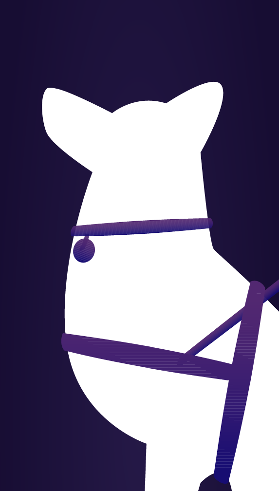

**gif**

## Contents
- [Project Idea](https://github.com/drawwithcode/2018-group-work-group-06/blob/master/README.md#project-idea--)
- [The research](https://github.com/drawwithcode/2018-group-work-group-06/blob/master/README.md#the-research--)
- [Design challenges](https://github.com/drawwithcode/2018-group-work-group-06/blob/master/README.md#design-challenges--)
  * [Architecture](https://github.com/drawwithcode/2018-group-work-group-06/blob/master/README.md#architecture--)
  * [Visuals](https://github.com/drawwithcode/2018-group-work-group-06/blob/master/README.md#visuals--)
  * [Sounds](https://github.com/drawwithcode/2018-group-work-group-06/blob/master/README.md#sounds--)
  * [Interactions](https://github.com/drawwithcode/2018-group-work-group-06/blob/master/README.md#interactions--)
- [Code challenges](https://github.com/drawwithcode/2018-group-work-group-06/blob/master/README.md#code-challenges--)
- [References](https://github.com/drawwithcode/2018-group-work-group-06/blob/master/README.md#references--)
- [Credits](https://github.com/drawwithcode/2018-group-work-group-06/blob/master/README.md#credits--)
- [Team members](https://github.com/drawwithcode/2018-group-work-group-06/blob/master/README.md#team-members--)
- [Course](https://github.com/drawwithcode/2018-group-work-group-06/blob/master/README.md#course--)

## Project Idea
**Have you ever wondered what blind people dream?**

If you have never seen anything in your life, you'd dream with your hearing, your smell and your touch.

The aim of the project is to provide a **blind person dream experience**.
We designed for the smartphone, because it allows to exploit different and interesting interactions. 

First, the user will move within a **maze** to get to the goal. The only **clues** that will have will be **made up of sounds**. Depending on the **origin of the sound, the user must turn** and, keeping the screen pressed, proceed forward until a new sound indicates the new road.

We have chosen to contextualize the **journey in a city**, in an attempt to return the most recurring nightmare of the blind: **to lose your guide dog**. 

Among all the sounds of the city the user will therefore be forced to distinguish the **barking of the dog**, paying attention to everything that surrounds it: bicycles, passers-by and cars.
Initially we thought to create a creepy sound experience that could be easily linked to a nightmare. We later abandoned the idea to avoid ridiculing the experience, encouraging an **audio editing as truthful as possible**.

## The research

To better understand the context in which we experimented, we went to [Dialogo nel Buio](http://www.dialogonelbuio.org/index.php/it/), a **sensorial experience** managed by the Istituto dei Ciechi in Milan. It’s important to note that Dialogo nel Buio does not want to provide a simulation of blindness but rather to **show new ways of experiencing reality**. After the visit we gathered several reflections. In particular, we were accompanied by **anxiety, insecurity and bewilderment**.

The research then moved on to the data.

From a [Danish research](http://sciencenordic.com/blind-people-have-four-times-more-nightmares-sighted-people) it emerged that, leaving aside the sensorial stimuli, **there are no particular differences** in the themes, emotions and interactions between the dreams of a person and a blind one.

The difference lies rather in an important detail: **the blind have many more nightmares, around 25% of dreams against 7% for sighted people**. The high percentage can be explained by the (hypothesized) reason that leads humans to have nightmares. In fact, nightmares would serve to **test ourselves against the dangers** that can be found in real life, to test our reactions. In a *visual* world the blind run more danger and in fact often find themselves dreaming of getting lost, being hit by a car, falling or not finding the guide dog anymore.

The percentages related to the use of every sense in a dream for those who are blind from birth are:
- taste → 26%
- smell → 40%
- hearing → 93%
- touch → 67%

## Design challenges
 
### Architecture 
[grafico]
 
### Visuals 
Visual choices focused on the **initial part of the homepage and instructions**.

The homepage is a **sliding onepage** that opens with the animated *Dark Dreams* logo. _Coming down from the clouds_ you get to the city and the bedroom, while the purpose of Dark Dreams is being told and it begins to be set through a story. Every written text is read to be accessible by anyone.

Instruction pages follow, accompanied by drawings to be more immediate. 
The actual experience starts from the last page.
 
In addition to the initial animation, each button has a visual feedback.
 
### Sounds
 

Due to its nature, the project is mainly developed on audio.

The first challenge was to choose sounds that could immerse the user in the city atmosphere and, at the same time, be distinguishable and provide feedback. In addition to the nature of sound itself, it was paid attention to its volume.
To be used by anyone and to involve the user more, each text is associated with the voice over. The choice of the warm, feminine and persuasive voice was carried forward keeping in mind the tone of the project.
 
Another point that has been addressed is the difficulty of the experience. To increase the difficulty without making it impossible to get to the end, the project was tested with several people to receive the feedback needed to calibrate the sounds and the path.
 
Initially it was possible to be hit by an obstacle and die, forcing the user to start over. Subsequently the death was removed to encourage an experience as continuous as possible. Instead of being hit, the obstacle brakes and the phone vibrates.

### Interactions  

There are two main interactions: **rotation** and **tap**. They have been chosen to make the experience **as immersive as possible**.

The first thing to do to proceed in the labyrinth is to **turn in the direction of the sound**.
 
To be able to go on, you have to **tap on the screen**.
 
When you get very close to an obstacle, however, **the cell phone vibrates**, trying to simulate the touch.

## Code challenges 
 
To develop the initial part of the homepage, HTML and CSS were used.
The main difficulty was managing responsiveness, difficulty managed thanks to the flexboxes.

--code--
 
Another difficult point was the animation of the buttons, initially designed from the png. In order to be freer in management, they were finally designed directly in CSS.

## References 

## Credits 

## Team members 
*Dark Dreams* was developed by:
- Federica Prunotto
- Ennio Sorrentino
- Livia Stevenin
- Irene Zanardi
 
## Course 
[Creative Coding 2018/2019](https://drawwithcode.github.io/2018/)

Politecnico di Milano - Scuola del Design

Faculty: Michele Mauri, Tommaso Elli

