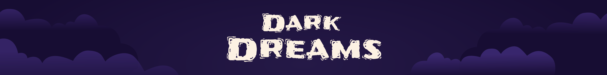


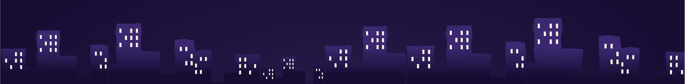

## Contents
- [The project](https://github.com/drawwithcode/2018-group-work-group-06/blob/master/README.md#the-project)
  * [The idea](https://github.com/drawwithcode/2018-group-work-group-06/blob/master/README.md#the-idea)
  * [The research](https://github.com/drawwithcode/2018-group-work-group-06/blob/master/README.md#the-research)
  * [Tone of voice](https://github.com/drawwithcode/2018-group-work-group-06/blob/master/README.md#tone-of-voice)
- [Design challenges](https://github.com/drawwithcode/2018-group-work-group-06/blob/master/README.md#design-challenges)
  * [Architecture](https://github.com/drawwithcode/2018-group-work-group-06/blob/master/README.md#architecture)
  * [Visuals](https://github.com/drawwithcode/2018-group-work-group-06/blob/master/README.md#visuals)
  * [Sounds](https://github.com/drawwithcode/2018-group-work-group-06/blob/master/README.md#sounds)
  * [Interactions](https://github.com/drawwithcode/2018-group-work-group-06/blob/master/README.md#interactions)
- [Code challenges](https://github.com/drawwithcode/2018-group-work-group-06/blob/master/README.md#code-challenges)
  * [The homepage](https://github.com/drawwithcode/2018-group-work-group-06#the-homepage)
  * [Feedbacks](https://github.com/drawwithcode/2018-group-work-group-06#feedbacks)
  * [The experience](https://github.com/drawwithcode/2018-group-work-group-06#the-experience)
    - [Character](https://github.com/drawwithcode/2018-group-work-group-06#character)
    - [Obstacles](https://github.com/drawwithcode/2018-group-work-group-06#obstacles)
    - [Dog and direction](https://github.com/drawwithcode/2018-group-work-group-06#dog-and-direction)
    - [Vibration](https://github.com/drawwithcode/2018-group-work-group-06#vibration)
- [References](https://github.com/drawwithcode/2018-group-work-group-06/blob/master/README.md#references)
- [Credits](https://github.com/drawwithcode/2018-group-work-group-06/blob/master/README.md#credits)
- [Team members](https://github.com/drawwithcode/2018-group-work-group-06/blob/master/README.md#team-members)
- [Course](https://github.com/drawwithcode/2018-group-work-group-06/blob/master/README.md#course)

## The project 

### The idea

**Have you ever wondered what blind people dream?**

If you have never seen anything in your life, you'd dream with your hearing, your smell and your touch.

The aim of the project is to provide a **blind person's dream experience**.
We designed it for the smartphone, because it allows to exploit different and interesting interactions. 

First, the user will move around a **maze** to get to the goal. The only **clues** available are **sounds**. Depending on the **origin of the sound, the user must turn** and, keeping the screen pressed, proceed forward until a new sound indicates the new road.

We have chosen to contextualize the **journey in a city**, in an attempt to evoke the most recurring nightmare of the blind: **to lose your guide dog**. 

Among all the sounds of the city the user will therefore be forced to distinguish the **barking of the dog**, paying attention to everything that surrounds it: bicycles, passers-by and cars.

[](http://www.youtube.com/watch?v=f3IDrRBufWs)

### The research

To better understand the context in which we experimented, we went to [Dialogo nel Buio](http://www.dialogonelbuio.org/index.php/it/), a **sensorial experience** managed by the Istituto dei Ciechi in Milan. It’s important to note that Dialogo nel Buio does not want to provide a simulation of blindness but rather to **show new ways of experiencing reality**. After the visit we gathered several reflections. In particular, we were accompanied by **anxiety, insecurity and bewilderment**.

The research then moved on to the data.

From a [Danish research](http://sciencenordic.com/blind-people-have-four-times-more-nightmares-sighted-people) it emerged that, leaving aside the sensorial stimuli, **there are no particular differences** in the themes, emotions and interactions between the dreams of a person and a blind one.

The difference lies rather in an important detail: **the blind have many more nightmares, around 25% of dreams against 7% for sighted people**. The high percentage can be explained by the (hypothesized) reason that leads humans to have nightmares. In fact, nightmares would serve to **test ourselves against the dangers** that can be found in real life, to test our reactions. In a *visual* world the blind incurs in more danger and in fact often find themselves dreaming of getting lost, being hit by a car, falling or not finding the guide dog anymore.

The percentages related to the use of every sense in a dream for those who are blind from birth are:
- Taste → 26%
- Smell → 40%
- Hearing → 93%
- Touch → 67%

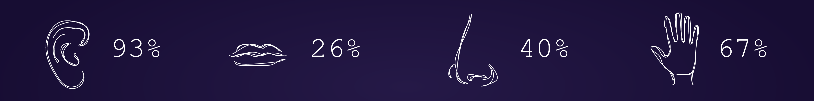

### Tone of voice
Initially we wanted to create a creepy sound experience that could be easily linked to a nightmare. We later abandoned the idea to avoid ridiculing the experience, which encouraged us to edit the audio as truthfully as possible. 

Visually, we wanted to keep things **as minimal as possible**, to quietly **counterbalance** the dream's **chaotic nature.**

We identified **three adjectives** that could describe the vibes we wanted to give:

- Quiet
- Dreamy
- Dark

These were kept as reference as we chose the visual style, as well as the voice over. 

## Design challenges
 
### Architecture 

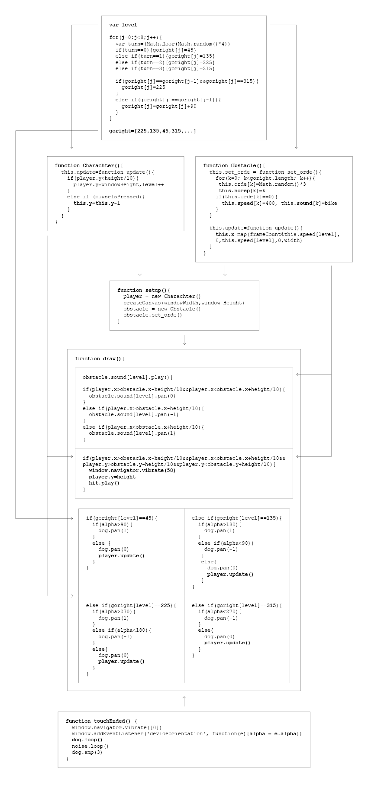
 
### Visuals 
Visual choices focused on the **initial part of the homepage and instructions**.

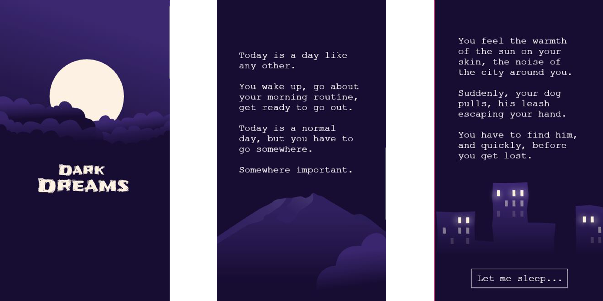

The homepage is a **onepage scroll** that opens with the animated *Dark Dreams* logo. The user is accompanied in her fall from the sky until she reaches the bedroom by an easy-to-read text describing the purpose and modes of the experience. Moreover, all the written text is read out loud to be accessible by anyone.

Instruction pages follow, accompanied by **drawings** to be more immediate. 
The actual experience starts from the last page.
 
### Sounds
 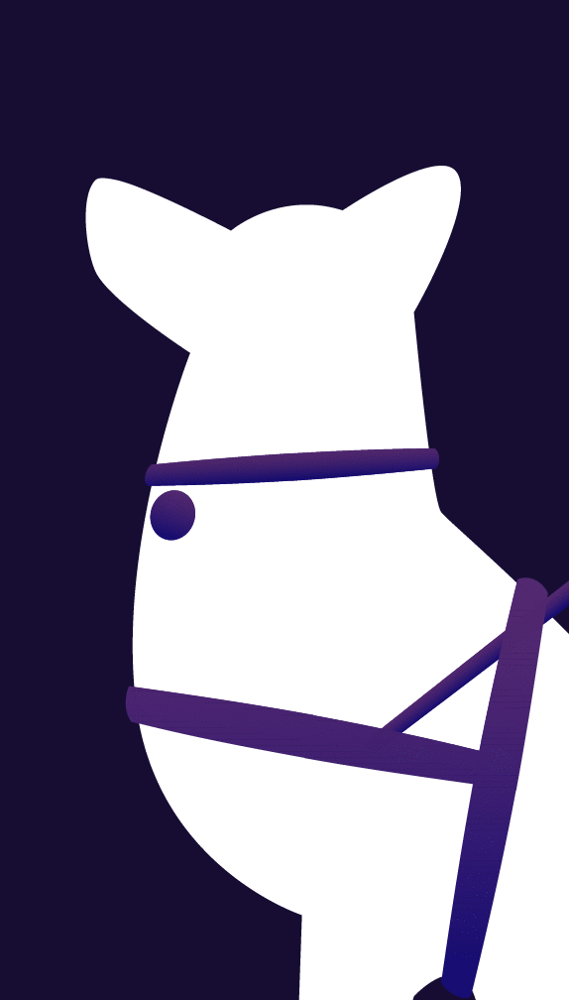

Due to its nature, the project is **mainly developed on audio**.

The first challenge was to choose sounds that could **immerse the user in the city atmosphere** and, at the same time, be **distinguishable** and provide **feedback**. In addition to the nature of the sound itself, it was paid attention to its **volume**.
To be used by anyone and to involve the user more, **each text is associated with its voiceover**. The choice of the warm, feminine and persuasive voice was carried forward keeping in mind the tone of the project.
 
Another point that has been addressed is how tough the experience is. To increase the difficulty without making it impossible to get to the end, the project was **tested** with several people to receive the feedback needed to **calibrate the sounds** and the path.
 
Initially it was possible to be hit by an obstacle and wake up, forcing the user to start over. Subsequently the "death" was removed to encourage an **experience as continuous as possible**. Instead of being hit, the obstacle brakes and the phone vibrates. The user will automatically **restart the level without quitting**.

### Interactions  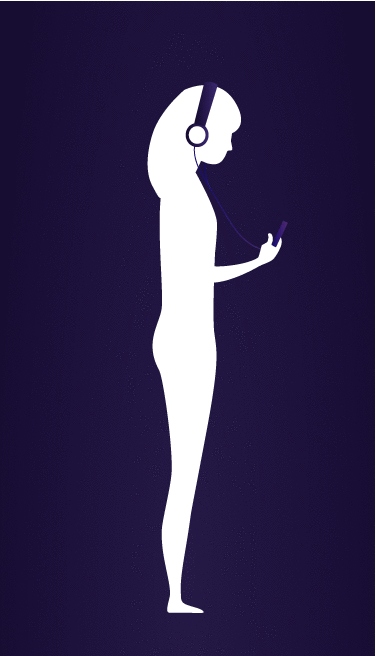

There are two main interactions: **rotation** and **tap**. They have been chosen to make the experience **as simple and immersive as possible**.

The first thing to do to proceed in the labyrinth is to **turn in the direction of the sound**.
 
To be able to go on, you then have to **tap on the screen**.
 
When you get very close to an obstacle, however, **the cell phone vibrates**, trying to simulate the touch.

## Code challenges 

### The homepage 
To develop the initial part of the homepage, **HTML and CSS** were used.
The main issue was managing **responsiveness**, which was done through the use of flex-boxes.

``` css
.flex-container {
        display: flex;
        flex-direction: column;
        align-items: center;
        height: 95vh;
        width: 100%;
        padding-top: 10%;
        margin-left: 0;
        margin-right: 0;
      }
```
 
Another difficult point was the animation of the buttons, initially designed starting from the png. In order to improve the ease of use, they were eventually designed directly in CSS.

``` css
  .typewriter  {
       overflow: hidden; 
       border-right: .15em solid; 
       white-space: nowrap; 
       margin: 0 auto;
       animation:
       typing 3.5s steps(20, end) infinite,
       blink-caret .75s step-end infinite;
     }

     /* The typing effect */
     @keyframes typing {
       from { width: 0 }
       to { width: 100% }
     }
     /* The typewriter cursor effect */
     @keyframes blink-caret {
       from, to { border-color: transparent }
       50% { border-color: #fcf1e3; }
     }
     
      .play-btn {
        margin-top: 5vh;
        margin-bottom: 2vh;
        width: 50px;
        height: 50px;
        background: radial-gradient(
          circle,
          rgba(23, 13, 51, 1) 0%,
          rgba(38, 22, 82, 1) 52%,
          rgba(60, 34, 109, 1) 100%
        );
        border-radius: 50%;
        position: relative;
        display: block;
        box-shadow: 0px 0px 25px 3px rgba(38, 22, 82, 1);
      }

      /* triangle */
      .play-btn::after {
        content: "";
        position: absolute;
        top: 50%;
        transform: translateX(-40%) translateY(-50%);
        transform-origin: center center;
        width: 0;
        height: 0;
        border-top: 10px solid transparent;
        border-bottom: 10px solid transparent;
        border-left: 20px solid #fff;
        z-index: 100;
        transition: all 400ms cubic-bezier(0.55, 0.055, 0.675, 0.19);
      }

      /* pulse wave */
      .play-btn:before {
        content: "";
        position: absolute;
        width: 100%;
        height: 100%;
        animation-delay: 0s;
        animation: pulsate1 2s;
        animation-direction: forwards;
        animation-iteration-count: infinite;
        animation-timing-function: steps;
        opacity: 1;
        border-radius: 50%;
        border: 5px solid rgba(255, 255, 255, 0.75);
        top: -11%;
        left: -11%;
        background: rgba(198, 16, 0, 0);
      }

      @keyframes pulsate1 {
        0% {
          transform: scale(0.6);
          opacity: 1;
          box-shadow: inset 0px 0px 25px 3px rgba(255, 255, 255, 0.75),
            0px 0px 25px 10px rgba(255, 255, 255, 0.75);
        }
        100% {
          transform: scale(1);
          opacity: 0;
          box-shadow: none;
        }
      }
 ```   

### Feedbacks
In addition to the title animation and to the loading page, each button has a **visual animated feedback**. 
 
#### Let me sleep Button
``` css
.typewriter  {
       overflow: hidden; 
       border-right: .15em solid; 
       white-space: nowrap; 
       margin: 0 auto;
       animation:
       typing 3.5s steps(20, end) infinite,
       blink-caret .75s step-end infinite;
     }
 
     /* The typing effect */
     @keyframes typing {
       from { width: 0 }
       to { width: 100% }
     }
     /* The typewriter cursor effect */
     @keyframes blink-caret {
       from, to { border-color: transparent }
       50% { border-color: #fcf1e3; }
     }
 ``` 
 
 <p align="center">
 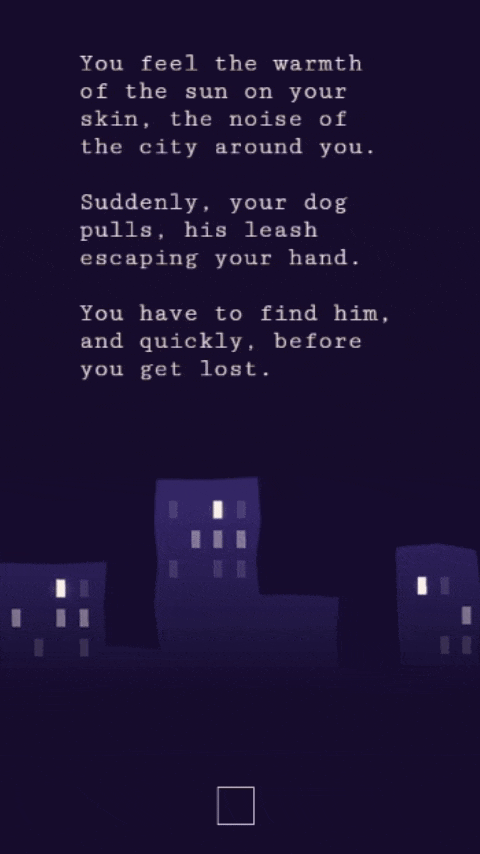
 </p>
 
#### Go on Button
``` css
.play-btn {
        margin-top: 5vh;
        margin-bottom: 2vh;
        width: 50px;
        height: 50px;
        background: radial-gradient(
          circle,
          rgba(23, 13, 51, 1) 0%,
          rgba(38, 22, 82, 1) 52%,
          rgba(60, 34, 109, 1) 100%
        );
        border-radius: 50%;
        position: relative;
        display: block;
        box-shadow: 0px 0px 25px 3px rgba(38, 22, 82, 1);
      }
 
      /* triangle */
      .play-btn::after {
        content: "";
        position: absolute;
        top: 50%;
        transform: translateX(-40%) translateY(-50%);
        transform-origin: center center;
        width: 0;
        height: 0;
        border-top: 10px solid transparent;
        border-bottom: 10px solid transparent;
        border-left: 20px solid #fff;
        z-index: 100;
        transition: all 400ms cubic-bezier(0.55, 0.055, 0.675, 0.19);
      }
 
      /* pulse wave */
      .play-btn:before {
        content: "";
        position: absolute;
        width: 100%;
        height: 100%;
        animation-delay: 0s;
        animation: pulsate1 2s;
        animation-direction: forwards;
        animation-iteration-count: infinite;
        animation-timing-function: steps;
        opacity: 1;
        border-radius: 50%;
        border: 5px solid rgba(255, 255, 255, 0.75);
        top: -11%;
        left: -11%;
        background: rgba(198, 16, 0, 0);
      }
 
      @keyframes pulsate1 {
        0% {
          transform: scale(0.6);
          opacity: 1;
          box-shadow: inset 0px 0px 25px 3px rgba(255, 255, 255, 0.75),
            0px 0px 25px 10px rgba(255, 255, 255, 0.75);
        }
        100% {
          transform: scale(1);
          opacity: 0;
          box-shadow: none;
        }
      }
  ```
 
 <p align="center">
 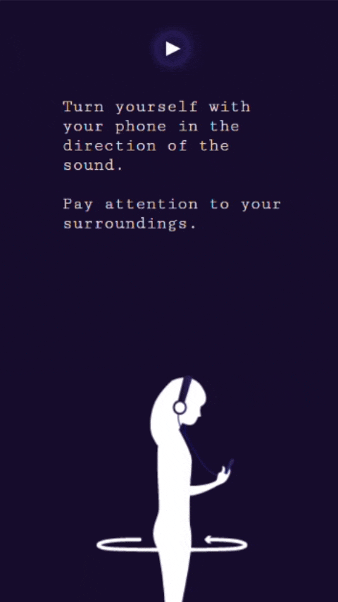
 </p>
 
#### Begin Button
``` css
flex-container .button {
        width: 100%;
        height: auto;
        padding: 0;
      }
      .button1 {
        content: "";
        color: #fcf1e3;
        text-decoration: none;
        font-family: "Cutive Mono", monospace;
        font-size: 5vw;
        margin-top: 5vh;
        margin-bottom: 2vh;
        width: 25vw;
        height: 5vh;
        background: radial-gradient(
          circle,
          rgba(23, 13, 51, 1) 0%,
          rgba(38, 22, 82, 1) 52%,
          rgba(60, 34, 109, 1) 100%
        );
        border-width: thin;
        position: relative;
        display: block;
        box-shadow: 0px 0px 25px 3px rgba(38, 22, 82, 1);
      }
 
      /* pulse wave */
      .button1:before {
        content: "";
        position: absolute;
        width: 100%;
        height: 100%;
        animation-delay: 0s;
        animation: pulsate1 2s;
        animation-direction: forwards;
        animation-iteration-count: infinite;
        animation-timing-function: steps;
        opacity: 1;
        border: 5px solid rgba(255, 255, 255, 0.75);
        top: -17%;
        left: -4%;
        background: rgba(198, 16, 0, 0);
      }
      #home {
        text-decoration: none;
      }
      button:active {
        outline: none;
      }
      @keyframes pulsate1 {
        0% {
          transform: scale(0.6);
          opacity: 1;
          box-shadow: inset 0px 0px 25px 3px rgba(255, 255, 255, 0.75),
            0px 0px 25px 10px rgba(255, 255, 255, 0.75);
        }
        100% {
          transform: scale(1);
          opacity: 0;
          box-shadow: none;
        }
      }
 ```
 
 <p align="center">
 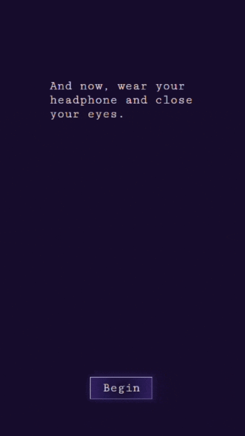
 </p>

#### Tap
``` javascript
if(mouseIsPressed){
  fill('white')

  push()
  noFill()
  stroke("white")
  strokeWeight(2)
   ellipse(mouseX,mouseY,width/8+frameCount%60)
   strokeWeight(4)
    ellipse(mouseX,mouseY,width/8+(frameCount%60*2))
    strokeWeight(6)
     ellipse(mouseX,mouseY,width/8+(frameCount%60*3))
  pop()}
}
```   

 <p align="center">
 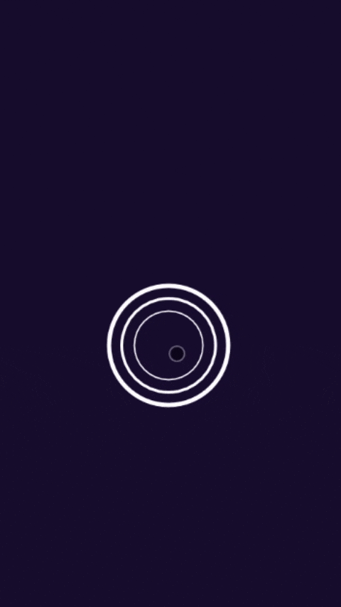
 </p>

### The experience
#### Character
The _update()_ method will allow us to proceed in the game, getting closer to our target and making us pass through the levels.

``` javascript
if (player.y < height / 10) {player.y = windowHeight, level++}
else if (mouseIsPressed) {this.y = this.y - 1}}
``` 

The _Character()_ code is really simple as the collision effect is called in the _draw()_ function where all the variables have already been set to their right values:

``` javascript
if (player.x > obstacle.x - height / 10 && player.x < obstacle.x + height / 10 && player.y > obstacle.y -height / 10 && player.y < obstacle.y + height / 10){
window.navigator.vibrate(50)
player.y = height}
}
```

Just as the Obstacle, _Character()_ function is called in the _setup()_ as they’ll not replicate them, as _Character()_ has always to act the same, and as all the values _Obstacle()_ is taking are set just once during the _setup()_.

#### Obstacles
Obstacles are managed by a _set_order()_ method that's called in the _setup()_ functions and sets all the values the Obstacle is taking during the game.

``` javascript
  this.set_orde = function set_orde(){
    for(k = 0; k < goright.length; k++){
      this.orde[k] = Math.floor (Math.random()*3)
      this.norep[k] = k
```

_Orde[…]_ array is containing values between 0 and 2 on which depend _sound[…]_ array and _magic_num […]_ array through the conditions:
 
 ``` javascript
      if (this.orde[k] == 0) {this.magic_num[k] = 400, this.sound[k] = bike}
      if (this.orde[k] == 1) {this.magic_num[k] = 682, this.sound[k] = car}
      if (this.orde[k] == 2) {this.magic_num[k] = 1320, this.sound[k] = ambulance}}
 ```
 
where _magic_num_ is equal to _sound duration(sec) * frameRate(default value equal to 60)_.

_Sound[…]_ array contains the sound variable associated to one kind of obstacle, as defined in the _preload()_:

``` javascript
bike = loadSound("./assets/moto sound.mp3")
```

_Magic_num[…]_ array values, that will manage the X position of the obstacle, synchronize it with the reproduction of the sound through the _update()_ method:
 
 ``` javascript
    this.x = map(frameCount % this.magic_num[level], 0, this.magic_num[level], 0, width)
 ```
 
_This.x_ will also influence the _pan()_ of the _obstacle.sound_ during the _draw()_ function.
 
``` javascript
if (player.x > obstacle.x - height / 10 && player.x < obstacle.x + height / 10){obstacle.sound[level].pan(0)}
else if (player.x > obstacle.x - height / 10){obstacle.sound[level].pan(-1)}
else if (player.x < obstacle.x + height / 10){obstacle.sound[level].pan(1)}
```

_Norep[…]_ array will contain ordinary values from 0 to 7 that will influence which sound is playing during the _draw()_ function.

``` javascript
if (level == obstacle.norep[level]) {obstacle.sound[level].play()}
```

#### Dog and direction
In the Global, _goright[…]_ array is going to randomly contain one of these four values: 45, 135, 225, 315. 

The following two lines of code are preventing two values from repeating:

``` javascript
if (goright[j] == goright[j - 1] && goright[j] == 315){goright[j] = 225}
 else if (goright[j] == goright[j - 1]){goright[j] = goright[j] + 90}
 ```
 
Through the _goright[…]_ values we can manage when and in which direction to play the dog sound that will guide the user, as it follows:

 ``` javascript
else if (goright[level] == 135){
  if (alpha > 180) {dog.pan(1)}
  else if (alpha < 90) {dog.pan(-1)}
  else {
    dog.pan(0)
    player.update()
  }
}
 
else if (goright[level] == 315){
  if (alpha  < 270) {dog.pan(-1)}
  else {
    dog.pan(0)
    player.update()
  }
}
 ```

We found easier to manage each direction separately, in order to limitate bug when the user get from 359 to 0 deg, the same reason that makes us use 45, 135, 225 and 315 as turning point instead of 0, 90, 180, 270.

The rotation is controlled by the alpha variable which return the current position over the x-axys of the phone, through the code:

``` javascript
window.addEventListener('deviceorientation', function(e){alpha = e.alpha;})
```
 
Beta and gamma variables are also supported but we decided not to introduce them, as we noticed the three variables often influenced each other causing disorders during the game.

#### Vibration
Because of restriction policy of iOS, we couldn’t implement the vibration for iPhones like we did for Android smartphones. 

Instead, for iOS **we replaced the vibration with another sound**. In this way, there is a useful feedback and iPhone users can play the esperience.

## References 
In addition to the research previously cited, images were collected as a reference point for the development of the visual part. Especially, the **blue and violet** color and the **simple lines** with few shades have been extracted.


The sounds were chosen after listening to the **streets noises**. We then searched for **blind simulations** to better understand how they were carried out. In particular, we found an [example on Youtube](https://www.youtube.com/watch?v=rpzSs0c-xyM) that described how crossing a street feels like. 

## Credits 
We developed the project using HTML, CSS and P5.

The title font is [Frijole](https://fonts.google.com/specimen/Frijole), while the texts are in [Nanum Gothic Coding](https://fonts.google.com/specimen/Nanum+Gothic+Coding).

The voiceover was recorded by [Diane Lehman](https://www.fiverr.com/dianeleh11).

The sounds were downloaded from [Freesound](https://freesound.org/).


## Team members 
*Dark Dreams* was developed by:
- Federica Prunotto
- Ennio Sorrentino
- Livia Stevenin
- Irene Zanardi
 
## Course 
[Creative Coding 2018/2019](https://drawwithcode.github.io/2018/)

Politecnico di Milano - Scuola del Design

Faculty: Michele Mauri, Tommaso Elli


